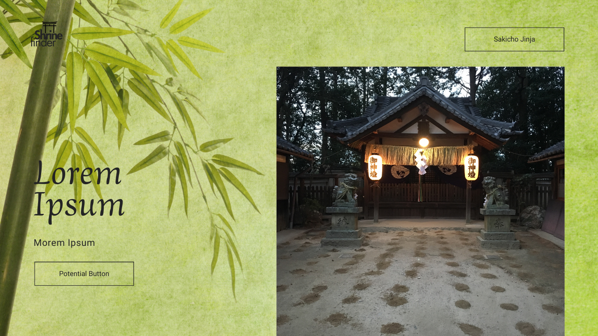
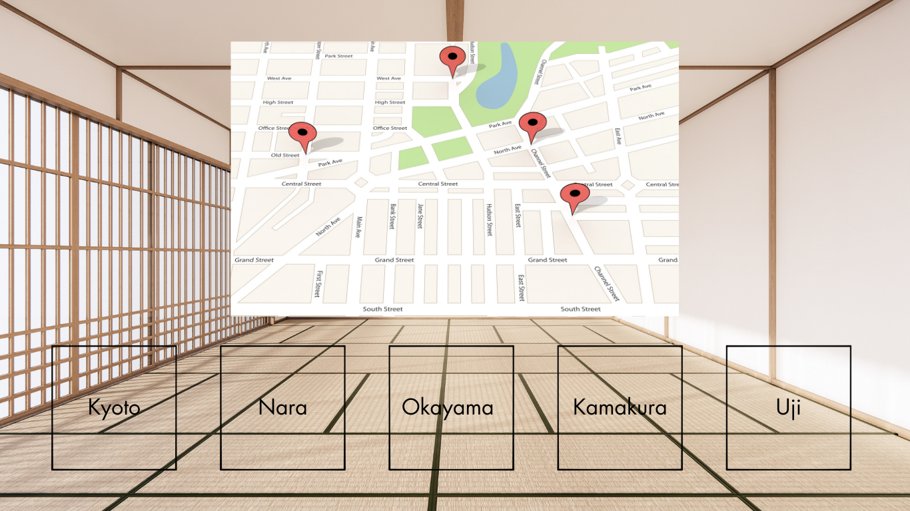

# Project Title

Shrine Finder ⛩️

## Overview

>There are estimated to be around 80,000 shrines in Japan. - wiki
Shrine Finder is a web applicatoin designed for tourists in Japan to discover lesser-known shrines that are off the beaten path. The app provides detailed information about each shrine, including unique features, associated deities, and available lucky charms (omamori) or shrine seals/calligraphy (goshuin).

### Problem

Japan has become increasingly crowded with tourism, making it challenging to find serene and less crowded shrines. The Shrine Finder app addresses this issue by helping users locate tranquil and unique shrines, enhancing their cultural experience. 

### User Profile

Target users: 
- tourists in Japan looking for cultural experiences
- individuals interested in Shintoism, Shinto shrines and Japanese culture
- individuals that are interested in hiking, nature, and slow life lifestyle
- individuals who want to learn more about shrines/Japanese Shintoism/Japanese Culture

### Features

- Users want to be able to find unique shrine sites near them 
- Users want to be able to find unique shrines that are not the main shrines in their networks, and find out why they are special
- Users want to be able to find unique features of shrines 
- Users want to know whether there are certain consumables for purchase at said shrines
- Users want to see a photo of a shrine to determine if it's worth visiting
- Users want to see user generated reviews about each location
- Users want to be able to upload and delete their own review of each location

## Implementation

### Tech Stack

- React
- Express
- Client libraries: 
    - react
    - react-router
    - axios
    - mapbox-sdk-js (potentially)
- Server libraries:
    - express
    - json file for storing shrine data initially

### APIs

- Mapbox API
- Google/Google Maps API
(one of the two, as yet undecided)

### Sitemap

**Styled across mobile, tablet, and desktop breakpoints**

- HomePage with two route paths showing a main shrine photo (potentially a placeholder) and then a menu of shrines at the bottom with locations depending on the city/town you're in then clicking a button takes you to a map (maybe with directions)

### Mockups





### Data

**Data Sources & Relationships**

This application fetches data from two separate data sources:
- Mapping API : Location Coordinates (latitude, longitude)
- JSON file on server containing supplementary data that enriches the MAP API data (see Endpoints for exmamples)

**Data Integration**
- API Calls: Axios makes a request to the mapping API using its URL and fetches the location data
- JSON File Retrieval: Axios fetches the JSON file located on the server
- Both datasets are processed and transformed as needed for the application's logic. Including parsing JSON data, extracting relevant information, and potentially combining data points based on identifiers (e.g., location ID). 


### Endpoints

- Mapbox API 
**GET /location/:place** - retrieves location

Response:
```
{
  "type": "FeatureCollection",
  "query": ["kasuga", "taisha"],
  "features": [
    {
      "id": "poi.1234567890abcdef",
      "type": "Feature",
      "place_type": ["poi"],
      "relevance": 1,
      "properties": {
        "landmark": true,
        "category": "shrine"
      },
      "text": "Kasuga Taisha",
      "place_name": "Kasuga Taisha, Nara, Japan",
      "center": [135.8497, 34.6814],
      "geometry": {
        "type": "Point",
        "coordinates": [135.8497, 34.6814]
      },
      "context": [
        {
          "id": "region.123456",
          "text": "Nara"
        },
        {
          "id": "country.123456",
          "text": "Japan"
        }
      ]
    }
  ],
  "attribution": "© Mapbox and its data providers"
}
```

- JSON data
**GET /shrines**  - retrieves a list of all shrines

Parameters:
- latitude: User-provided location as a number
- longitude: User-provided location as a number

Response:
```
[
    {
        "id": 1,
        "name": "Kasuga Taisha",
        "location": {"lat": 34.6814, "lng": 135.8497},
        "city": "Nara",
        "country": "Japan",
        "image": "/filepath/image.jpeg"
        "description": "Known for its many bronze and stone Kasuga lanterns and its significance to the Fujiwara clan.",
        "deities": ["Takemikazuchi", "Futsunushi", "Amenokoyane", "Himegami"],
        "features": ["Lanterns", "Sacred Deer park"],
        "reviews": []
    },
    ...
]
```

**GET /shrines/:id** - detailed information about a specific shrine

Response - same as above but isolated by ID

**POST /shrines/reviews** - add a review for a specific shrine

Request body:
```

    {
        "rating": 5,
        "comment": "I was here for the new years celebrations and the food stalls were amazing!"
        
    }
    
```
Response:
```
[
    {
        "id": 1,
        "name": "Kasuga Taisha",
        "location": {"lat": 34.6814, "lng": 135.8497},
        "city": "Nara",
        "country": "Japan",
        "description": "Known for its many bronze and stone Kasuga lanterns and its significance to the Fujiwara clan.",
        "deities": ["Takemikazuchi", "Futsunushi", "Amenokoyane", "Himegami"],
        "features": ["Lanterns", "Sacred Deer park"],
        "reviews": [
            {
              "rating": 5,
              "comment": "I was here for the new years celebrations and the food stalls were amazing!"
            }
        ]
    },
    ...
]
```

**DELETE /shrines/reviews** : - delete a review for a specific shrine

Response: Status message indicating success or failure.

### Auth

(Authentication is not planned for the initial version. If login functionality and user profies are added at a later point, authentication methods will be added here.)

## Roadmap

- Create client
    - react project with routes and boilerplate pages

- Create server
    - express project with routing, with placeholder xxx responses

- Gather 10-15 sample shrine geolocations in 5 different cities (maybe less)

- Deploy client and server projects so all commits will be reflected in production

- Create API endpoints server side

- Create JSON data file server side

- Create API classes + methods client side

- Feature: List shrines from a given location under each respective heading
    - Implement list shrine section page 

- Feature: View shrines
    - Implement view shrine page (maybe the main page)

- Feature: Review shrines
    - Add form input to view shrine page
    - Create POST /ratings
    - States for add & update ratings 

- Some more steps here    

- Feature: Home page

- Bug fixes

- DEMO DAY

## Nice-to-haves

**Wikipedia API Integration:** Fetches detailed information about certain shrines and adds a glossary component
**Geolocation API:** Adding ability to find shrines near user's location
**Search Filters:** Search by shrine features, deities, etc.
**Multi Language Support:** Provide information in multiple languages for international tourists
**mySQL or MongooseDB:** Holds data + photos in one database instead of JSON file, will have to do more research to see if this makes sense 
**Cover Page** for a more polished feel
